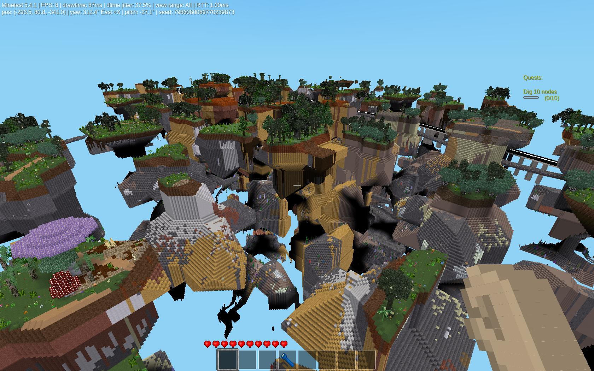
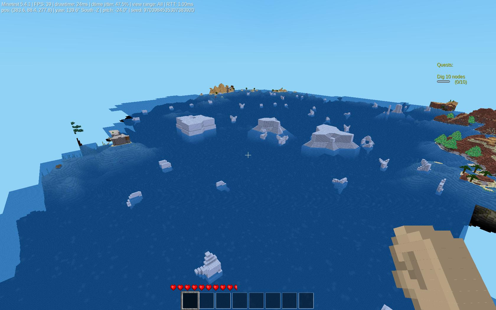
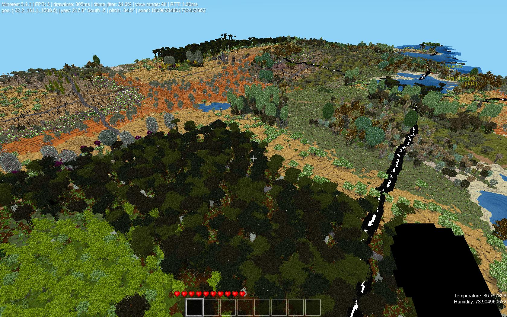

mg_earth.

Licensed under LGPL v2.1
Author:  Shad MOrdre aka Steven Merchant.
Copyright: Sept. 2022

Forum Topic:	https://forum.minetest.net/viewtopic.php?f=9&t=27374
Github:			https://github.com/ShadMOrdre/mg_earth
ContentDB:		https://content.minetest.net/packages/ShadMOrdre/mg_earth/

Credits for code:  Gael de Sailley, paramat, Termos, Sokomine, demon_boy, duane, dokimi, Pyrollo, burli
Credits for textures: paramat
License for textures: CC BY-SA 3.0

SCREENSHOT:

mg_earth is a lua based mapgen.  Features are listed below:

	v2d_noise mapgen is a simple single 2d noise terrain generator.
	v3d_noise mapgen is a simple single 3d noise terrain generator.
	v3D mapgen is based on paramats' LVM_Example.  Determines "density" from single 3d noise.
	v5 mapgen.  (Currently non functional.  Only produces flat terrain.)
	v6 mapgen with builtin biome, ore, and decoration support.
	v7 mapgen without mountains, ridges, floatlands, and altering the "base terrain" noise to use the same seed as the "alt terrain" noise.
	vCarpathian mapgen in both 2d and 3d variants.
	vDiamondSquare mapgen uses the "diamond-square" algorythm to generate terrain.  Akin to standard noise.  Must use a fixed size.
	vEarth mapgen uses voronoi cells to define continents, rivers, and mountains.
	vEarthSimple mapgen is a simplified vEarth, removing rivers code and not altering noise based terrain additives.
	vIslands mapgen is a modified version of Termos' Islands mapgen, eliminiating that mods mountains in favor of terrain based on modified v7.
	vLargeIslands mapgen is the same as vIslands, except uses larger scale and spread values.
	vNatural mapgen is a simplified vEarth mapgen, using Carpathian and Islands code to generate continental terrain.
	vAltNatural mapgen is the same as above, but generates run Carpathian code before Cliffs code.
	vValleys mapgen in both 2d and 3d variants.  Uses Gael de Sailleys' Valleys mapgen

	vBuiltin mapgen adds ability to use all engine based mapgens.
	vSinglenode mapgen adds ability to use other lua based mapgens that create a 2d indexed heightmap, compatible with the voxelmanip heightmap object.

All of the above listed 2d mapgens are additive, and can be enabled simultaneously.  The above 3d mapgens can only be used by themselves.  The 3D mapgens are:
	(v3d_noise, v3D, v5, and vCarpathian and vValleys when the 3d option is enabled.)
	
Additional mapgens included are:  (These are available via the heightmap select option.  vFlat is a 2d mapgen, while all others below are 3D)

	vFlat mapgen sets the entire heightmap to the settings value.
	vCubes mapgen creates a chunk sized cube determined by distance to random point within chunk.  (Chebyshev distance creates squared/cubed voronoi cells.)
	vDiamonds mapgen creates a chunk sized diamond determined by distance to random point within chunk.  (Manhattan distance creates angled/diamond voronoi cells.)
	vSpheres mapgen creates a chunk sized sphere determined by distance to random point within chunk.  (Euclidean distance creates round/spheroid voronoi cells.)
	vTubes mapgen creates an interlocking tube network per chunk.  Tube shape is determined by distance metric.
	vVoronoiCell mapgen creates unique 3D voronoi cells per chunk.  Cell shape and appearance are determined by distance metric.
	vPlanetoids mapgen creates random spheres throughout the map, based on 2D voronoi.
	vPlanets mapgen creates random spheres throughout the map, based on 3D voronoi.
	vSolarSystem mapgen creates a "scaled" model of the Solar System.  Planet sizes are to scale with each other, and distances are to scale.  Based on 3D voronoi.
	
Additional settings enable the following:  (These affects can be applied simultaneously.)

	enable_v6_scalar uses heat / humidity values to determine strength of v6 terrain.  Higher heat and lower humidity, or low heat and high humidity increase the strength.
	enable_carpathia allows other mapgens to use the mountain building code of vCarpathia, in a scaled down form.
	enable_cliffs allows other mapgens to use the cliff building code of vIslands.
	
	heat_scalar applies a real world heat model to the map.  Hot equator, cold poles.
	humidity_scalar applies a real world humidity model to the map.  Should mimic the patterns associated with ocean based weather.
	
	enable_boulders creates voronoi shaped boulders, rocks, mesas, and icebergs.
	
	enable_rivers allows rivers on vValleys and vEarth mapgens.  Non functional for all other mapgens.
	enable_lakes allows use of code from Sokomines' lake mod.
	
	enable_caves carves caves below the surface.
	enable_caverns carves large caverns deeper.
	
	enable_cities draw city like grid of streets randomly on map.  Based on paramats' NoiseGrid mod.  Can use path, road, or street logic.
	enable_paths draws a dirt or gravel path at a set interval across the map.
	enable_roads draws a cobblestone road at a set interval across the map.  Based on paramats' pathv7 mod.
	enable_streets draws a modern street at a set interval across the map.  Based on paramats' roadv7 mod.
	
Each of the above may have addition settings, such as cave size, grid size, or width.

The following settings are used across all mapgens.

	mg_world_scale allows the user to scale the generated map.  This can be used to "see" an entire world map.  Can be scaled from 10 times, down to 0.01.
	mg_base_height sets the maximum height used by voronoi based mapgens.
	sea_level set the sea level.  Should be same as map_meta value, but this is internal, and can be scaled.
	
	seed sets the mapgen seed.  This affects the builtin mapgen, so if using with an engine based mapgen, this overrides the seed value in map_meta.
	
	voronoi_distance selects which distance metric will be used.  Choose between Chebyshev, Euclidean, Manhattan, or (Chebyshev + Manhattan / 2)
	
	voronoi_points_file selects which file to use to load voronoi points.  Currently hard coded, but should read from folder.
	voronoi_neighbors_suffix determines the suffix to apply to generated Voronoi Cell Neighbors file.

Additional settings allow the user to define noise values for all available mapgens.

mg_earth is compatible with aotearoa, australia, darkages, default, ethereal, gal, naturalbiomes, underch, and valleys_c.

If gal is active, mg_earth can create gal ecosystems alongside existing biome mods.  Also, if gal is active, then that mod determines world scale, base height, and sea level.

Features of mg_earth include a voxelmanip compatible heightmap, biomemap, citymap, riversmap, path, road, and streets maps, and provides generic information about the currently
generated chunk.  Chat commands to emerge and load areas, and an active hud that gives heat and humidity values, based on actual values.  These are interpreted to mean Farenheit.

Current issues are v5 mapgen and vEarth rivers.

Understanding that terrain affects the roads and streets, so if there are breaks or disconnects, it is most likely very jaggy or extreme terrain.

This is still an actively developed project, and while released and fully functional, there may still be bug fixes, other changes or feature additions.

